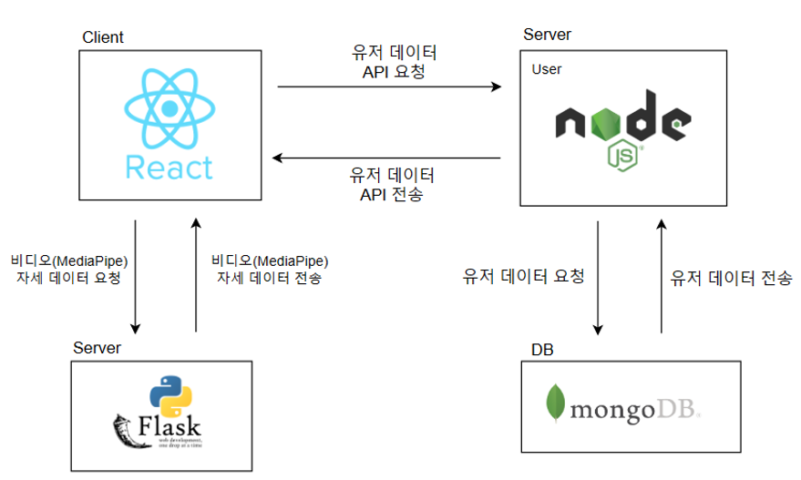

# 운동메이트 Back-End(node.js)

# **운동메이트** 배경
  고령화 사회가 되어가고 있는 지금 건강관리는 선택이 아닌 필수가 되어 가고 있습니다. 
  우리가 개발한 운동메이트 웹앱은 웹캠을 통해 실시간으로 사용자의 자세를 교정해줄 수 있습니다. 
  그리고 메이트들과 함께 하는 운동을 통해 운동에 대한 즐거움을 줍니다. 
  결과적으로 단기적인 운동이 아닌 장기적으로 운동을 할 수 있도록 동기부여를 줍니다. 

# **운동메이트** 과제 수행 결과
  운동 기록 저장되 메이트 팀 정보공유 기능을 통해 사용자가 혼자서 할 때 뿐만 아니라 메이트와 함께 운동 현황을 공유하며 동기부여를 받을 수 있도록 합니다

  
# 시스템 구성도



# **운동메이트** 서버 api

  - ### 유저 정보 api - /user router
    
    | method | api url | function description |
    | --- | --- | --- |
    | get | /getUserFullInfo | 로그인 시 유저 정보 전달 |
    | get | /getRecommendUsers | 팔로우 할 수 있는 메이트 리스트 전달 |
    | get | /initialGoal | superuser가 특정 유저의 운동 목표를 초기화 |
    | get | /getPosts | 팔로우한 메이트들의 게시글 피드 전달 |
    | get | /getMyPosts | 유저가 작성한 유저의 게시글 불러오기 |
    | get | /getFollowersExercisesStatus | 팔로우한 메이트들의 운동 상태 전달 |
    | get | /getOtherUserInfo/:userId | 타 유저들의 정보 확인 |
    | post | /sendVerificationCode | 회원가입 시 유저의 이메일로 6자리 인증번호를 보냄 |
    | post | /verifyCode | 유저가 전달받은 6자리 인증번호를 인증 |
    | post | /registerSimpleUser | 세부 정보를 입력하지 않고 이메일, 비밀번호로만 회원가입 |
    | post | /registerDetailUser | 세부 정보를 입력하고 회원가입|
    | post | /login | 로그인 |
    | post | /followUser | 메이트 팔로우 |
    | post | /goalSetting | 운동 목표 설정 |
    | post | /getFollowers | 유저가 팔로우한 메이트 목록 전달 |
    | post | /getFollowing | 유저를 팔로잉하는 메이트 목록 전달 |
    | post | /isPasswordCorrect | 유저 정보 수정 시 비밀번호 재확인 |
    | post | /getUnfollow | 메이트 언팔로우 |
    | post | /uploadPost | 게시글 업로드(사진, 글) |
    | post | /updateUserExerciseAttain | 운동 후 달성값 저장 |
    | post | /postUserPostComment | 게시글 댓글 등록 |
    | post | /getOtherUserFollowersFollowing | 타 유저들의 팔로우, 팔로잉 목록 전달 |
    | post | /postUserPostHeart | 게시글 좋아요 등록 |
    | put | /updateProfile | 유저 정보 수정 |
    | put | /updateInformation | 유저 세부 정보 수정 |
    | put | /updatePassword | 유저 비밀번호 수정 |
    | put | /updateMyPost/:postId | 게시글 수정 |
    | put | /updateInformationPublic | 유저의 세부 정보를 타 유저들에게 공개 여부 설정 |
    | delete | /deleteFollowers | superuser가 특정 유저의 팔로우 리스트를 초기화 |
    | delete | /deleteMyPost/:postId | 게시글 삭제 |
    | delete | /deleteUserPostComment/</br>:userId/:postId/:commentId | 게시글에 등록한 댓글 삭제 |
    | delete | /initialUserPostComment | superuser가 특정 게시글의 댓글 삭제 |
    | delete | /deleteUserPost | superuser가 특정 유저의 게시글 삭제 |

  - ### 메이트 팀 api - /team router

    | method | api url | function description |
    | --- | --- | --- |
    | get | /getAllTeams | 가입하지 않은 메이트 팀 목록 전달 |
    | get | /getJoinedTeams | 가입한팀 목록 전달 |
    | get | /getTeamInfo/:teamId | 특정 팀의 정보 전달 |
    | get | /getTeamNotice/:teamId | 특정 팀의 공지글들 전달 |
    | get | /getTeamBoard/:teamId | 특정 팀의 게시판 글 전달 |
    | get | /getTeamMembers/:teamId | 특정 팀에 가입한 메이트 목록 전달 |
    | get | /getTeamMembersExerciseStatus/:teamId | 특정 팀에 가입한 메이트들의 운동 상대 전달 |
    | get | /getJoinedTeamInfo | 유저가 가입한 메이트 팀의 정보 전달 |
    | post | /createTeam | 새로운 메이트 팀 만들기 |
    | post | /joinTeam | 메이트 팀 가입 |
    | post | /postTeamNotice/:teamId | 특정 팀의 공지글 등록 |
    | post | /postTeamBoard/:teamId | 특정 팀의 게시판 글 등록(자유게시판, 익명게시판) |
    | post | /postTeamBoardComment/:teamId | 특정 팀의 게시판 게시글에 댓글 등록 |
    | put | /updateTeamNotice/:teamId/:noticeId | 특정 팀에 유저가 작성한 공지글 수정 |
    | put | /updateTeamBoard/:teamId/:boardId | 특정 팀에 유저가 작성한 게시글 수정|
    | delete | /quitTeam/:teamId | 메이트 팀 탈퇴 |
    | delete | /deleteTeam/:teamId | 메이트 팀 방장이 팀 삭제 |
    | delete | /deleteTeamNotice/:teamId/:noticeId | 특정 팀에 유저가 작성한 공지글 삭제 |
    | delete | /deleteTeamBoard/:teamId/:boardId | 특정 팀에 유저가 작성한 게시글 삭제 |
    | delete | /deleteTeamBoardComment/:teamId/</br>:boardId/:commentId | 특정 팀의 게시판에 유저가 등록한 댓글 삭제 |
     

  ## 프로젝트 디렉터리 구조
```
  Node.js

  server
  ├─controllers
  │  ├─teamController.js
  │  ├─userController.js
  ├─routes
  │  ├─teams.js
  │  ├─users.js
  ├─models
  │  ├─team.js
  │  ├─user.js
  ├─views
  │  ├─error.jade
  │  ├─index.jade
  │  ├─layout.jade
  ├─public
  ├─app.js
  ├─package-lock.json
  └─package.json
```

# Database - MongoDB

## User Document

- ### 기본 유저 - userSchema

  | 필드 | 타입 |
  | --- | --- |
  | name | String |
  | email | String |
  | password | String |
  | sex | String |
  | area | String |
  | height | String |
  | weight | String |
  | age | String |
  | exercise | String |
  | wishList | Array |
  | followers | [ObjectId] |
  | following |  [ObjectId] |
  | goal | goalSchema |
  | post | [userPostSchema] |
  | team | [ObjectId] |
  | setting | [userSettingSchema] |


- ###  유저 포스트 - userPostSchema

  | 필드 | 타입 |
  | --- | --- |
  | image | String |
  | content | String |
  | date | date |
  | likes| String |
  | comments | [ ] |
  | └─user | String |
  |└─userId | ObjectId |
  |└─content | String |


- ### 유저 운동 목표 - goalSchema

    | 필드 | 타입 |
    | --- | --- |
    | dDay | Date |
    | goals | [ ] |
    |└─label | String |
    |└─cycle | String |
    |└─number | String |
    |└─attain | String |
  

- ### 유저 정보 공개 여부 - userSettingSchema

    | 필드 | 타입 |
    | --- | --- |
    | isFollowPublic | Boolean |
    | isAgePublic | Boolean |
    | isAreaPublic | Boolean |
    | isWeightPublic | Boolean |
    | isHeightPublic | Boolean |
    | isExercisePublic | Boolean |
    | isWishListPublic | Boolean |
    | isPostPublic | Boolean |
  
## Team Document

- ### 메이트 팀 - teamSchema

    | 필드 | 타입 |
    | --- | --- |
    | name | String |
    | hashtag | String |
    | description | String |
    | host | hostSchema |
    | members | [ObjectId] |
    | notice | [noticeSchema] |
    | freeBoard | [freeBoardSchema] |
    | anonymousBoard | [anonymousBoardSchema] |

    
- ### 팀장 - hostSchema
  
   | 필드 | 타입 |
   | --- | --- |
   | hostName | String |
   | hostId | ObjectId |


- ### 익명게시판 - anonymousBoardSchema 

    | 필드 | 타입 |
   | --- | --- |
    | postTitle | String |
    | postContent | String |
    | likes | [String] |
    | comments | [String] |
    

- ### 자유게시판 - freeBoardSchema 

  | 필드 | 타입 |
   | --- | --- |
  | postTitle | String |
  | postContent | String |
  | author | String |
  | authorId | ObjectId |
  | likes | [ObjectId] |
  | comments | [ ] |
  | └─user | String |
  | └─content | String |
  | └─userId | ObjectId |

- ### 공지 - noticeSchema 

    | 필드 | 타입 |
   | --- | --- |
  | noticeTitle | String |
  | noticeContent | String |
  | author | String |
  | authorId | ObjectId |
  
  
# Conventions

## ⚙ 사용 기술

### :earth_africa: Environment

<div>
    
    
    
</div>

<br />

### :pick: Development

<div>
    
    
    
  
</div>

<br />

### :mega: Communication

<div>
    
    
</div>

<br />

## 채팅 socket.io 서버

```

const io = new Server(server, {
        path: '/chat',
        cors: {
            origin: [
                'http://localhost:3000',
                'https://pose2team.vercel.app']
        },
    }
);

io.on("connection", (socket) => {
    console.log(`User Connected: ${socket.id}`);

    socket.on("join_room", (data) => {
        socket.join(data);
    });

    socket.on("send_message", (data) => {
        socket.to(data.room).emit("receive_message", data);
        console.log(data)
    });
});

```
